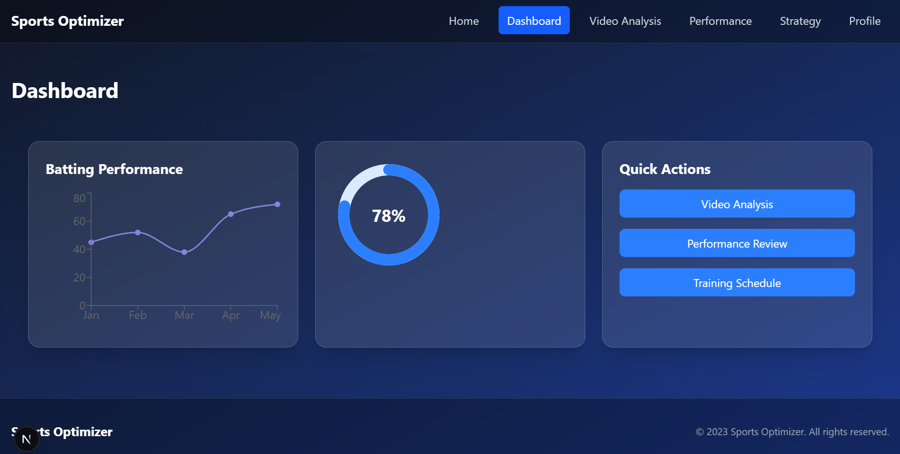
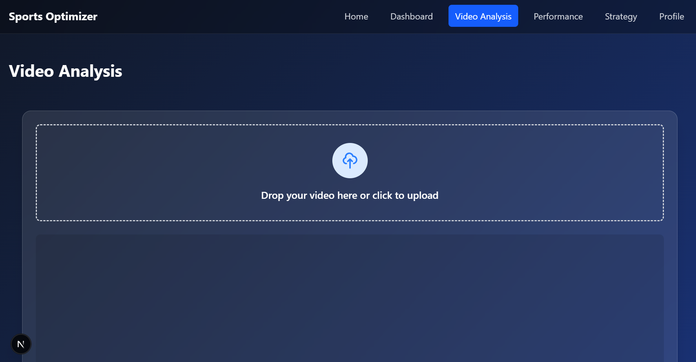
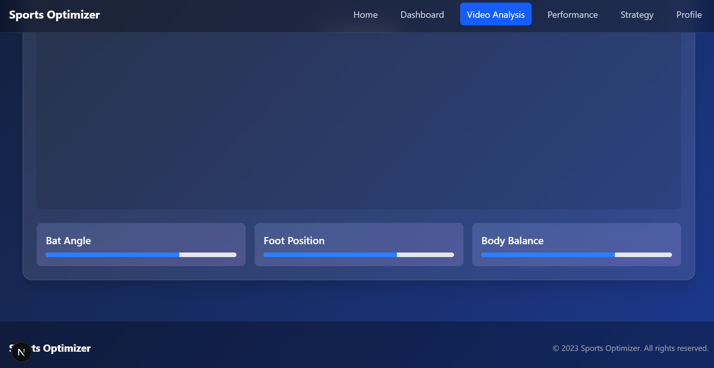
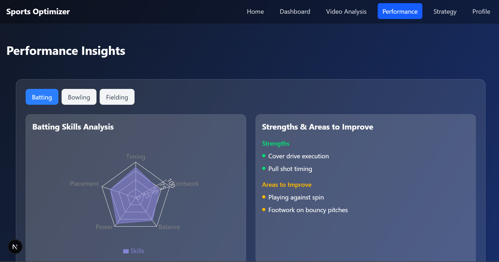
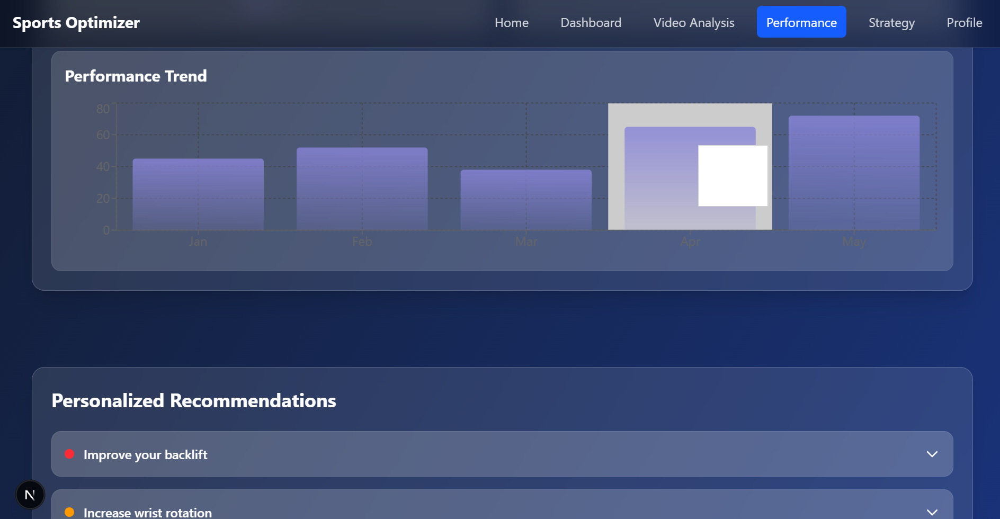
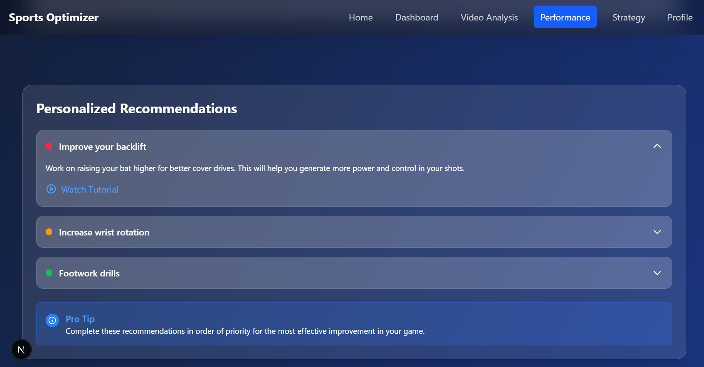
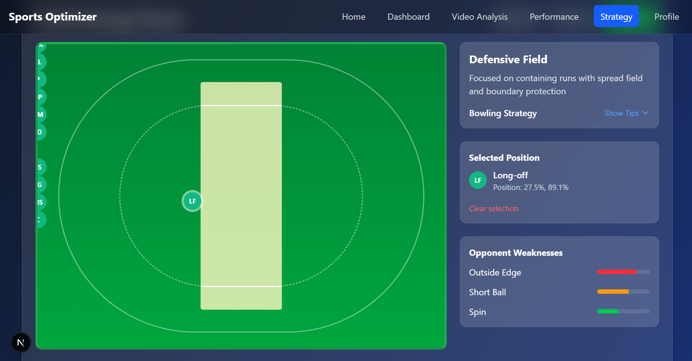
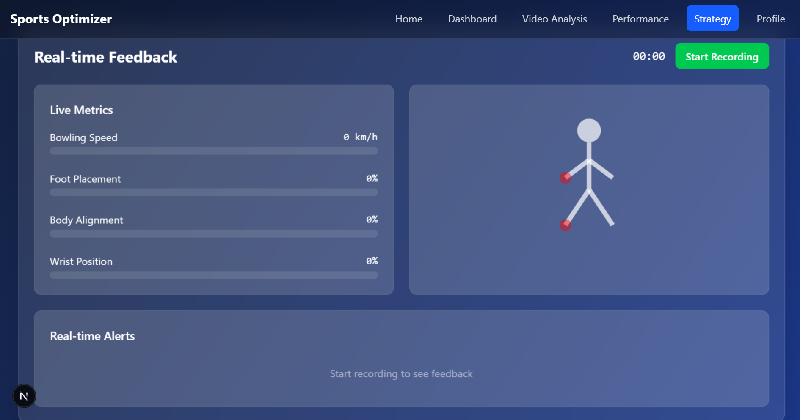
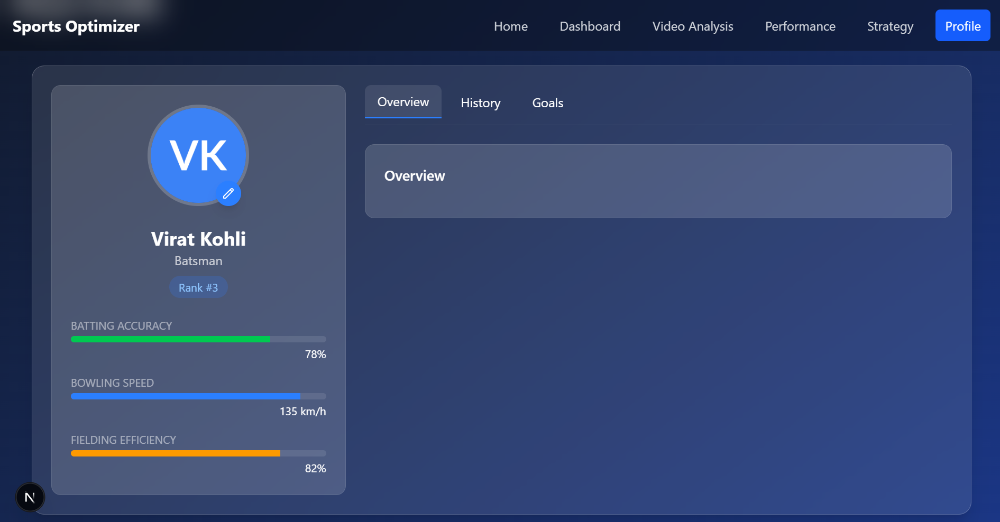

# Sports Optimizer

A modern web application for cricket players to optimize their performance through AI-driven insights, personalized coaching, and real-time feedback.

## Features

- 🏏 **Profile Management**
  - Player statistics tracking
  - Performance history visualization
  - Goal setting and progress monitoring
  - Customizable player profiles

- 📊 **Real-time Analysis**
  - Performance metrics
  - Personalized recommendations
  - Progress tracking
  - Visual feedback

- 🏆 **Leaderboard System**
  - Player rankings
  - Role-based comparisons
  - Performance statistics

- 🎯 **Smart Recommendations**
  - AI-driven improvement suggestions
  - Priority-based training plans
  - Access to tutorial content
  - Personalized coaching tips

## Tech Stack

- **Framework**: Next.js 14 with App Router
- **Language**: TypeScript
- **Styling**: Tailwind CSS
- **Animations**: 
  - Framer Motion
  - React Spring
- **Data Visualization**: Recharts
- **Fonts**: Geist Sans & Geist Mono

## Getting Started

### Prerequisites

- Node.js 18.x or later
- npm or yarn

### Installation

1. Clone the repository:
\```bash
git clone https://github.com/yourusername/sports-optimizer.git
cd sports-optimizer
\```

2. Install dependencies:
\```bash
npm install
# or
yarn install
\```

3. Run the development server:
\```bash
npm run dev
# or
yarn dev
\```

4. Open [http://localhost:3000](http://localhost:3000) in your browser.

## Contributing

1. Fork the repository
2. Create your feature branch (\`git checkout -b feature/AmazingFeature\`)
3. Commit your changes (\`git commit -m 'Add some AmazingFeature'\`)
4. Push to the branch (\`git push origin feature/AmazingFeature\`)
5. Open a Pull Request


## Screenshots of the project









